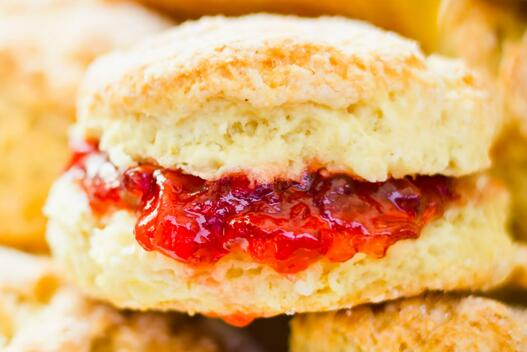

#### 多列
```css
main {
    -webkit-column-width: 12em;
    column-width: 12em;
    /*固定列数*/
    -webkit-column-count: 4;
            column-count: 4;
    /*列间距*/
    -webkit-column-gap: 2em;
            column-gap: 2em;
    /*列间分格线*/
    -webkit-column-rule: thin dotted #999;/*分割线的类型| 颜色|宽度*/
            column-rule: thin dotted #999; 
    -webkit-column-rule-width: 5px;
            column-rule-width: 5px;
  }
```
#### 换行
```
word-wrap: break-word|normal;
```
#### 水平滚动
```html
<style>
  .truncate {
    width: 200px;
    overflow: hidden;
    text-overflow: ellipsis; /* ellipsis(以点点显示)|clip */
    white-space: nowrap; /*nowrap(不换行)|normal*/
  }

  .Scroll_Wrapper {
    width: 100%;
    white-space: nowrap;
    overflow-x: auto;
    overflow-y: hidden;
    /* 在WebKiet的触摸设备上出现 */
    -webkit-overflow-scrolling: touch;
    /* 在支持的IE中删除滚动条 */
    -ms-overflow-style: none;
  }

  /* 防止WebKit浏览器中出现滚动条 */
  .Scroll_Wrapper::-webkit-scrollbar {
    display: none;
  }

  .Item {
    width: 200px;
    display: inline-flex;
    white-space: pre-wrap;
  }

  .Item img {
    width: 100px;
    height: 50%;
    display: block;
  }
</style>
<div class="Scroll_Wrapper">
  <div class="Item">
    
    OK, listen up, I've figured out the key eternal
    happiness. All you need to do is eat lots of scones.
  </div>
  <div class="Item">
    
    OK, listen up, I've figured out the key eternal
    happiness. All you need to do is eat lots of scones.
  </div>
  <div class="Item">
    
    OK, listen up, I've figured out the key eternal
    happiness. All you need to do is eat lots of scones.
  </div>
  <div class="Item">
    
    OK, listen up, I've figured out the key eternal
    happiness. All you need to do is eat lots of scones.
  </div>
  <div class="Item">
    
    OK, listen up, I've figured out the key eternal
    happiness. All you need to do is eat lots of scones.
  </div>
</div>
```
####　@supports(){}特性查询[MDN说明](https://developer.mozilla.org/zh-CN/docs/Web/CSS/@supports)
使用Modernizr来获取浏览器是否支持[使用说明](https://github.com/modernizr/modernizr)
```css
/*在支持padding属性的浏览器中执行`{}`内的属性*/
@supports (padding: inherit) {}
/*如果浏览器不支持`该属性`则执行下面的语句*/
@supports not (padding: inherit) {}
/*组合条件:使用`()`隔开[`and` = &; `or` = || ]*/
@supports ((display: flex) and (pointer: coarse)) or (transform:
translate3d(0, 0, 0)) {
.Item {
display: inline-flex;
}
}
```
#### 新 CSS3 选择符
属性选择器
```css
img[alt]{
  /*样式*/
}
img[alt="sausages"]
[data-sausage]{
  /*样式*/
}
```
CSS3子字符串匹配属性选择符
> 以...开头
```html


```
```css
img[alt^="film"]{
  /*样式*/
}
```
> 包含....
```html
<p data-ingredients="scones cream jam">
  Will I get selected?
</p>
```
```css
[data-ingredients*="cream"]{
  /*样式*/
}
```
> 以...结尾
```html
<p data-ingredients="scones cream jam">Will I get selected?</p>
<p data-ingredients="toast jam butter">Will I get selected?</p>
<p data-ingredients="jam toast butter">Will I get selected?</p>
```
```css
[data-ingredients$="jam"]{
  /*样式*/
}
```
> 以空格隔开
```css
[data-ingredients~="jam"]{
  /*样式*/
}
```
> 多个选择
```css
[data-ingredients$="butter"][data-ingredients*="jam"]{
  /*样式*/
}
```
> `HTML5`允许`ID`和类以数值开头,但`CSS`还不允许使用以数值开头的选择符
```css
[id="10"]{
  /*样式*/
}
```
#### CSS3 结构化伪类
```html
<nav class="nav-Wrapper">
  <a href="/home" class="nav-Link">Home</a>
  <a href="/About" class="nav-Link">About</a>
  <a href="/Films" class="nav-Link">Films</a>
  <a href="/Forum" class="nav-Link">Forum</a>
  <a href="/Contact-Us" class="nav-Link nav-LinkLast">Contact Us</a>
</nav>
```
> `:first-child`|`:last-child`
```css
div:first-child {/*第一个*/
/* 样式 */
}
div:last-child {/*最后一个*/
/* 样式 */
}
/*案例*/
@media (min-width: 60rem) {
  .nav-Wrapper {
    display: flex;
  }
  .nav-Link:last-child {
    margin-left: auto;
  }
}
```
> `:nth-child`
```css
.nav-Link:nth-child(odd) {
/* 奇数样式 */
}
.nav-Link:nth-child(even) {
/* 偶数样式 */
}
```
理解`nth`
```css
/*`3`:表示从左边的第三个起;*/
span:nth-child(2n+3) {}
/*表示反转*/
span:nth-child(-2n+3) {}
/*从最后倒数第三个开始,间隔一`n`执行*/
span:nth-last-child(n+3) {
  color: #f90;
  border-radius: 50%;
}
```